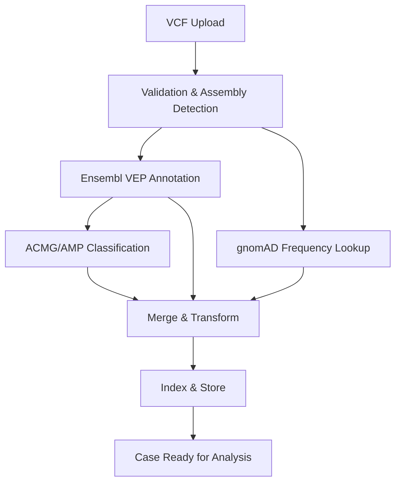

When you upload a VCF file to a case, Purna runs a multi-stage bioinformatics pipeline that annotates every variant with clinical classifications, population frequencies, functional predictions, and database cross-references. This page explains each stage in detail.

## Supported inputs

<CardGroup cols={2}>
  <Card title="GRCh37 (hg19)" icon="dna">
    Human genome build 37. Commonly used in legacy clinical pipelines and exome data.
  </Card>
  <Card title="GRCh38 (hg38)" icon="dna">
    Human genome build 38. The current reference standard for clinical and research sequencing.
  </Card>
</CardGroup>

**File formats accepted:**
- `.vcf` (uncompressed)
- `.vcf.gz` (gzip or bgzip compressed)
- `.zip` archives containing VCF files

**Variant limits:**
- Up to **1 million variants** per case (suitable for Whole Exome Sequencing and targeted panels)
- For Whole Genome Sequencing files exceeding this limit, contact our enterprise team at [contact@purna.ai](mailto:contact@purna.ai)

<Note>
You do not need to specify the genome assembly. Purna auto-detects whether your VCF is GRCh37 or GRCh38 by inspecting the file header, contig lengths, and chromosome naming conventions.
</Note>

## Pipeline overview

Each stage is described in detail below.

---

## Stage 1: Validation and assembly detection

Once your VCF is uploaded, the pipeline validates the file format and automatically detects the genome assembly.

**Assembly detection uses multiple signals, in priority order:**
1. VCF header fields (`##genomeBuild`, `##reference`, `##assembly`)
2. Contig lengths in the header (chromosome 1 length differs between GRCh37 and GRCh38)
3. Chromosome naming conventions (`chr` prefix patterns)

After detection, the pipeline selects the matching reference genome, VEP cache, and annotation databases for all downstream stages.

## Stage 2: Variant annotation with Ensembl VEP

Every variant is annotated using **Ensembl Variant Effect Predictor (VEP) release 115** with RefSeq transcripts.

### Transcript selection

Purna selects the most clinically relevant transcript per gene using a strict priority order:

| Priority | Criterion |
|----------|-----------|
| 1 | **MANE Select** — the agreed-upon primary clinical transcript |
| 2 | **MANE Plus Clinical** — additional clinically relevant transcripts |
| 3 | Canonical transcript |
| 4 | APPRIS principal isoform |
| 5 | Transcript Support Level (TSL) |
| 6 | Biotype ranking |
| 7 | CCDS membership |
| 8 | Rank, length, RefSeq status |

This ensures that the transcript shown for each variant is the one most relevant for clinical interpretation.

### Annotations added by VEP

**HGVS nomenclature:**
- Coding DNA change (c. notation, e.g., `NM_007294.4:c.5266dupC`)
- Protein change (p. notation, e.g., `NP_009225.1:p.(Gln1756ProfsTer74)`)
- Genomic coordinate (g. notation)

**Consequence and functional impact:**
- Sequence Ontology consequence terms (e.g., `missense_variant`, `frameshift_variant`, `splice_donor_variant`)
- Consequence severity ranking (used for gene-level prioritization)
- Exon and intron positions (e.g., exon 10/23)
- Affected codons and amino acid changes

**Transcript and gene metadata:**
- RefSeq transcript ID (NM_) and protein ID (NP_)
- Gene symbol and NCBI Gene ID
- Biotype classification
- Canonical and MANE Select flags

**In silico predictions:**

| Predictor | Output | Scale |
|-----------|--------|-------|
| **SIFT** | Score + prediction (Deleterious / Tolerated) | 0 (damaging) to 1 (tolerated) |
| **PolyPhen-2** | Score + prediction (Probably Damaging / Possibly Damaging / Benign) | 0 (benign) to 1 (damaging) |
| **AlphaMissense** | Score + pathogenicity class | 0 (benign) to 1 (pathogenic) |

**ClinVar annotations:**
- Clinical significance (Pathogenic, Likely Pathogenic, Uncertain Significance, Likely Benign, Benign)
- Review status (criteria provided, reviewed by expert panel, practice guideline, etc.)
- Associated conditions and phenotypes
- ClinVar accession ID (VCV)

**dbSNP identifiers:**
- rsID from colocated variants (e.g., `rs80357906`)

## Stage 3: Population frequency lookup (gnomAD)

Each variant is queried against the Genome Aggregation Database (gnomAD) for population allele frequencies.

| Genome Build | gnomAD Version | Dataset | Sample Size |
|-------------|---------------|---------|-------------|
| GRCh38 | v3 | Genomes | ~76,000 samples |
| GRCh37 | v2.1.1 | Exomes | ~125,000 samples |

### Frequency fields per variant

**Global frequencies:**
- Allele frequency (AF), allele count (AC), allele number (AN)
- Homozygote count

**Population-specific frequencies:**

| Population | GRCh38 (v3) | GRCh37 (v2.1.1) |
|-----------|-------------|-----------------|
| Non-Finnish European (NFE) | Yes | Yes |
| African / African American (AFR) | Yes | Yes |
| East Asian (EAS) | Yes | Yes |
| South Asian (SAS) | — | Yes |
| Latino / Admixed American (AMR) | Yes | Yes |
| Finnish (FIN) | Yes | Yes |
| Ashkenazi Jewish (ASJ) | Yes | Yes |

**Maximum population frequency:**
- The highest AF across all populations is computed and stored alongside the name of that population group — useful for ACMG BA1 and BS1 criteria evaluation.

<Note>
gnomAD v3 (GRCh38) is a genome-only dataset and does not include South Asian (SAS) population frequencies. If SAS frequency data is critical for your analysis, GRCh37 cases use gnomAD v2.1.1 exomes which include full SAS data.
</Note>

## Stage 4: ACMG/AMP classification

Every variant receives an automated ACMG/AMP pathogenicity classification using a rule-based classifier that evaluates standard criteria against the annotated evidence.

### Criteria evaluated

The classifier assesses **28 ACMG/AMP criteria** across pathogenic and benign evidence categories:

**Pathogenic criteria:**

| Strength | Criteria |
|----------|---------|
| Very Strong | PVS1 (null variant in gene where LOF is a known mechanism of disease) |
| Strong | PS1 (same amino acid change as established pathogenic), PS2 (de novo), PS3 (functional studies), PS4 (prevalence in affected vs controls) |
| Moderate | PM1 (mutational hot spot), PM2 (absent from controls), PM3 (detected in trans with pathogenic), PM4 (protein length change), PM5 (novel missense at established position), PM6 (assumed de novo) |
| Supporting | PP1 (cosegregation), PP2 (missense in gene with low benign rate), PP3 (in silico support), PP4 (phenotype specificity), PP5 (reputable source) |

**Benign criteria:**

| Strength | Criteria |
|----------|---------|
| Stand-alone | BA1 (allele frequency >5% in any population) |
| Strong | BS1 (greater frequency than expected for disorder), BS2 (observed in healthy adult), BS3 (functional studies show no impact), BS4 (lack of segregation) |
| Supporting | BP1 (missense in gene where truncating causes disease), BP2 (observed in trans/cis with pathogenic), BP3 (in-frame in repetitive region), BP4 (in silico benign), BP5 (alternate molecular basis), BP6 (reputable source reports benign), BP7 (synonymous with no splice impact) |

### Classification output

Each variant is assigned one of five classes based on the combination of active criteria:

| Classification | Criteria Combination |
|---------------|---------------------|
| **Pathogenic** | PVS1 + ≥1 Strong; or ≥2 Strong; or 1 Strong + ≥3 Moderate/Supporting |
| **Likely Pathogenic** | PVS1 + 1 Moderate; or 1 Strong + 1–2 Moderate; or 1 Strong + ≥2 Supporting |
| **Uncertain Significance (VUS)** | Criteria do not meet pathogenic or benign thresholds |
| **Likely Benign** | 1 Strong + 1 Supporting benign criteria |
| **Benign** | BA1 stand-alone; or ≥2 Strong benign criteria |

For each variant, the specific criteria that contributed to the classification are stored along with their supporting evidence. You can review these in the [ACMG tab](/guides/acmg) of the variant detail panel.

<Tip>
Automated classifications are a starting point. Purna's AI Enhance feature in the ACMG tab lets you re-evaluate criteria interactively, pulling in additional evidence from ClinVar, PubMed, gnomAD, and functional databases to refine the classification.
</Tip>

## Stage 5: Merge and transform

All annotation sources are merged into a single unified variant record:

- VEP annotations (consequence, HGVS, predictions, ClinVar, dbSNP)
- gnomAD population frequencies (global + per-population)
- ACMG classification and criteria evidence
- Sample-level genotype data extracted from the VCF (GT, DP, GQ, AD, VAF)

**Genotype and zygosity derivation:**

| VCF Genotype (GT) | Zygosity |
|-------------------|----------|
| 0/0 or 0\|0 | Reference (homozygous ref) |
| 0/1 or 0\|1 | Heterozygous |
| 1/1 or 1\|1 | Homozygous (alt) |
| 1 (hemizygous, X/Y) | Hemizygous |

**Multi-gene handling:**
When a variant affects multiple genes, the most clinically severe gene annotation is designated as the primary record. Alternate transcript annotations are preserved and available in the variant detail panel.

## Stage 6: Index and store

The fully annotated variants are indexed for fast querying and stored for long-term access.

- **Search index** — Each variant is indexed with full-text search on gene names and structured filtering on all annotation fields. This powers the variant search, filtering, and analytics features throughout the platform.
- **Data warehouse** — Variant records are stored in a columnar data warehouse for aggregations, exports, and cross-case analysis.

Once indexing completes, your case status updates to **Ready** and all variants are available for analysis in the case tabs, chat queries, and code execution.

---

## Data available per variant

After the pipeline completes, each variant in your case contains the following fields:

<AccordionGroup>
  <Accordion title="Variant identity and position" icon="location-dot">
    Chromosome, position, reference allele, alternate allele, variant type (SNV, insertion, deletion, indel), genomic HGVS coordinate (g. notation), dbSNP rsID, and cytoband.
  </Accordion>
  <Accordion title="Gene and transcript annotation" icon="dna">
    Gene symbol, NCBI Gene ID, RefSeq transcript ID (NM_), protein ID (NP_), biotype, MANE Select / canonical flags, coding DNA change (HGVS c.), protein change (HGVS p.), consequence terms (Sequence Ontology), consequence severity rank, exon/intron position, affected codons and amino acids.
  </Accordion>
  <Accordion title="In silico predictions" icon="microchip">
    SIFT score and prediction, PolyPhen-2 score and prediction, AlphaMissense score and pathogenicity class.
  </Accordion>
  <Accordion title="Population frequencies (gnomAD)" icon="earth-americas">
    Global allele frequency (AF), allele count (AC), allele number (AN), homozygote count. Per-population frequencies for NFE, AFR, EAS, SAS (GRCh37 only), AMR, FIN, ASJ. Maximum population frequency and the population group it belongs to.
  </Accordion>
  <Accordion title="ClinVar" icon="hospital">
    ClinVar accession ID, clinical significance, review status, associated conditions and phenotypes, ClinVar version date.
  </Accordion>
  <Accordion title="ACMG/AMP classification" icon="scale-balanced">
    Pathogenicity classification (Pathogenic, Likely Pathogenic, VUS, Likely Benign, Benign), active ACMG criteria codes with supporting evidence for each.
  </Accordion>
  <Accordion title="Sample and genotype" icon="vial">
    Sample ID, zygosity, genotype (GT), read depth (DP), genotype quality (GQ), allele depths (AD), variant allele frequency (VAF), filter status (PASS or filter codes).
  </Accordion>
  <Accordion title="Phenotype matching" icon="magnifying-glass">
    HPO-based phenotype match scores when phenotypes are associated with the case — including match count, total count, and match percentage.
  </Accordion>
</AccordionGroup>

## Reference databases

Purna's annotation pipeline draws from the following databases. All databases are updated regularly to ensure your analyses reflect the latest available evidence.

| Database | Used For | Version |
|----------|---------|---------|
| **Ensembl VEP** | Consequence prediction, transcript annotation, HGVS | Release 115 |
| **RefSeq** | Transcript definitions and gene models | RS_2024_08 |
| **ClinVar** | Clinical variant classifications and phenotype associations | Updated monthly |
| **gnomAD** | Population allele frequencies | v3 (GRCh38), v2.1.1 (GRCh37) |
| **AlphaMissense** | Deep learning-based missense pathogenicity prediction | v1.0 |
| **SIFT** | Sequence homology-based functional prediction | Via VEP 115 |
| **PolyPhen-2** | Structure and sequence-based functional prediction | Via VEP 115 |
| **dbSNP** | Variant identifiers (rsIDs) | Build 156 |

<Tip>
We keep all reference databases on a regular update schedule. If there is a specific database or annotation source you would like to see added to the pipeline, let us know at [contact@purna.ai](mailto:contact@purna.ai) — we are very receptive to feedback and actively prioritize requests from our users.
</Tip>

## Processing time

Pipeline duration depends on the number of variants and the genome build:

| Case Type | Typical Variant Count | Estimated Time |
|-----------|----------------------|---------------|
| Targeted gene panel | 100 – 5,000 | 2 – 5 minutes |
| Whole Exome Sequencing | 30,000 – 100,000 | 5 – 15 minutes |
| Large WES / Small WGS | 100,000 – 1,000,000 | 15 – 45 minutes |

You will receive a notification when your case is ready for analysis. You can continue working in other cases or chat sessions while the pipeline runs.

## Enterprise pipeline options

Enterprise customers have access to extended pipeline capabilities:

- **FastQ processing** — Upload raw sequencing reads (FastQ files) for alignment and variant calling on Nvidia Parabricks GPU infrastructure
- **Custom databases** — Integrate your own licensed databases such as HGMD Professional or VarSome Pro using your API keys
- **Custom pipeline configurations** — Request modifications to annotation sources, filtering criteria, or output formats tailored to your workflow

Contact [contact@purna.ai](mailto:contact@purna.ai) to discuss enterprise options.
